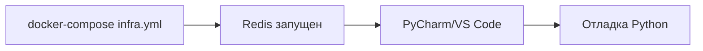

# Docker Configuration Overview

Обзор новой Docker конфигурации следуя стандартам wiki-engine.

## Структура директории

```
.docker/
├── dockerfiles/               # Docker образы
│   └── backend/
│       └── Dockerfile         # Multi-stage build для Python backend
├── configs/                   # Конфигурации окружений
│   ├── .env.local            # Локальная разработка
│   ├── .env.dev              # Dev окружение
│   └── .env.prod             # Production окружение
├── docker-compose.local.yml   # Full stack для разработки
├── docker-compose.infra.yml   # Только инфраструктура (Redis)
├── docker-compose.dev.yml     # Только app (stateless deployment)
├── README.md                  # Полная документация
├── QUICKSTART.md             # Быстрый старт
├── MIGRATION.md              # Руководство по миграции
└── OVERVIEW.md               # Этот файл
```

## Ключевые компоненты

### 1. Dockerfile (Multi-stage build)

**Путь:** `.docker/dockerfiles/backend/Dockerfile`

**Особенности:**
- Multi-stage build (builder + runtime)
- Python 3.11-slim базовый образ
- Установка зависимостей из `pyproject.toml`
- Опциональная поддержка GPU (через build arg)
- Tini как init процесс
- Копирование только необходимых директорий (src/, config/, scripts/)

**Build аргументы:**
- `PYTHON_VERSION` - версия Python (по умолчанию 3.11)
- `INSTALL_GPU` - установка GPU версии PyTorch (по умолчанию false)
- `CUDA_VERSION` - версия CUDA (по умолчанию 12.1.0)

**Размер образа:**
- Builder stage: ~2GB (с build tools)
- Runtime stage: ~1.5GB (оптимизирован)

### 2. Environment Configs

#### .env.local (Локальная разработка)

```bash
SOP__DEBUG=true
SOP__SERVER__RELOAD=true
DEVICE=cpu
INSTALL_GPU=false
```

**Для чего:**
- Разработка с hot-reload
- Отладка
- Минимальные требования к ресурсам

#### .env.dev (Development deployment)

```bash
SOP__DEBUG=false
SOP__SERVER__RELOAD=false
DEVICE=cuda
INSTALL_GPU=true
SOP__SERVER__WORKERS=2
```

**Для чего:**
- Dev/Stage окружения
- Тестирование с GPU
- Близко к production настройкам

#### .env.prod (Production)

```bash
SOP__DEBUG=false
SOP__LOG__LEVEL=WARNING
DEVICE=cuda
SOP__SERVER__WORKERS=4
# Секреты через переменные окружения
```

**Для чего:**
- Production deployment
- Оптимизация производительности
- Безопасное управление секретами

### 3. Docker Compose файлы

#### docker-compose.local.yml

**Сервисы:**
- `redis` - Redis 7 Alpine
- `app` - Backend приложение с hot-reload
- `redis-commander` - UI для Redis

**Volume mapping:**
- `../../src:/app/src:rw` - Hot-reload для исходников
- `../../config:/app/config:rw` - Конфигурация
- `sop_llm_models_cache_local` - Кэш моделей HuggingFace

**Порты:**
- 8001 - API
- 9091 - Metrics
- 8082 - Redis Commander
- 6381 - Redis

**Использование:**
```bash
cd .docker
docker-compose -f docker-compose.local.yml up --build
```

#### docker-compose.infra.yml

**Сервисы:**
- `redis` - Только Redis
- `redis-commander` - UI для Redis (профиль `tools`)

**Для чего:**
- Запуск приложения вне Docker (PyCharm, VS Code)
- Минимальная инфраструктура
- Быстрая разработка

**Использование:**
```bash
cd .docker
docker-compose -f docker-compose.infra.yml up

# В другом терминале
python -m uvicorn src.main:app --reload
```

#### docker-compose.dev.yml

**Сервисы:**
- `app` - Только backend (stateless)

**Особенности:**
- Нет volume mapping исходников
- Redis подключается извне
- GPU поддержка включена
- Для deployment окружений

**Использование:**
```bash
export REDIS_HOST=redis.example.com
export REDIS_PORT=6379
cd .docker
docker-compose -f docker-compose.dev.yml up --build
```

## Сравнение конфигураций

| Аспект | local | infra | dev |
|--------|-------|-------|-----|
| **Redis** | ✅ Включен | ✅ Только Redis | ❌ Внешний |
| **App** | ✅ С hot-reload | ❌ Запускается отдельно | ✅ Stateless |
| **Volume mapping** | ✅ src/, config/ | ❌ Нет | ❌ Только кэш/логи |
| **GPU** | ❌ По умолчанию CPU | N/A | ✅ Включен |
| **Debug** | ✅ Включен | N/A | ❌ Выключен |
| **Workers** | 1 | N/A | 2 |
| **Redis Commander** | ✅ Всегда | ✅ Профиль tools | ❌ Нет |

## Рабочие процессы

### Процесс 1: Локальная разработка


**Команды:**
```bash
cd .docker
docker-compose -f docker-compose.local.yml up
# Редактируйте файлы в src/
# Изменения применяются автоматически
```

### Процесс 2: Разработка через IDE



**Команды:**
```bash
cd .docker
docker-compose -f docker-compose.infra.yml up -d

# В IDE
# Run/Debug: python -m uvicorn src.main:app --reload
```

### Процесс 3: Deployment


**Команды:**
```bash
export REDIS_HOST=redis.example.com
cd .docker
docker-compose -f docker-compose.dev.yml up -d
```

## Volumes

### Локальная разработка

| Volume | Назначение | Персистентность |
|--------|-----------|-----------------|
| `sop_llm_redis_data_local` | Redis данные | ✅ Сохраняется |
| `sop_llm_models_cache_local` | HuggingFace кэш | ✅ Сохраняется |
| `sop_llm_app_logs_local` | Логи приложения | ✅ Сохраняется |
| `../../src:/app/src` | Исходники (bind mount) | ✅ Live sync |

### Dev deployment

| Volume | Назначение | Персистентность |
|--------|-----------|-----------------|
| `sop_llm_models_cache_dev` | HuggingFace кэш | ✅ Сохраняется |
| `sop_llm_app_logs_dev` | Логи приложения | ✅ Сохраняется |

## Безопасность

### Локальная разработка
- Пароли не требуются
- Все порты открыты на localhost
- Redis без аутентификации

### Dev/Prod окружения
- Redis пароль через `${REDIS_PASSWORD}`
- API ключи через переменные окружения
- Секреты НЕ в .env файлах

**Примеры:**
```bash
# Dev
export REDIS_PASSWORD="dev_password_12345"
export ANTHROPIC_API_KEY="sk-ant-..."

# Prod (через secrets management)
kubectl create secret generic sop-llm-secrets \
  --from-literal=redis-password=... \
  --from-literal=anthropic-api-key=...
```

## Производительность

### Ресурсы (по умолчанию)

| Окружение | CPU | Memory | GPU |
|-----------|-----|--------|-----|
| **local** | 4 cores | 8GB | Опционально |
| **dev** | 8 cores | 16GB | 1x NVIDIA |
| **prod** | Настраивается | Настраивается | 1x+ NVIDIA |

### Оптимизации

**Local:**
- 1 worker (минимум)
- CPU режим (быстрый старт)
- Минимальный кэш

**Dev:**
- 2 workers
- GPU режим
- Средний кэш (30 мин)

**Prod:**
- 4+ workers
- GPU режим
- Максимальный кэш (60 мин)
- Connection pooling (200 connections)

## Мониторинг

### Healthchecks

**Redis:**
```yaml
healthcheck:
  test: ["CMD", "redis-cli", "--raw", "incr", "ping"]
  interval: 10s
  timeout: 3s
  retries: 5
```

**App:**
```yaml
healthcheck:
  test: ["CMD", "curl", "-f", "http://localhost:8000/health"]
  interval: 30s
  timeout: 10s
  retries: 3
  start_period: 60s
```

### Endpoints

- `/health` - Простой health check
- `/api/v1/health` - Детальный статус всех компонентов
- `http://localhost:9091/metrics` - Prometheus метрики
- `ws://localhost:8001/ws/monitoring` - WebSocket мониторинг

## Логирование

### Local
- Формат: text (читаемый)
- Уровень: DEBUG
- Вывод: stdout + файл

### Dev
- Формат: JSON (structured)
- Уровень: INFO
- Вывод: stdout + файл

### Prod
- Формат: JSON (structured)
- Уровень: WARNING
- Вывод: stdout (для aggregation)

## Troubleshooting

### Проблема: Порт занят

```bash
# Изменить порт
export APP_PORT=8080
docker-compose -f docker-compose.local.yml up
```

### Проблема: Нет места на диске

```bash
# Очистка
docker system prune -a --volumes
docker volume prune
```

### Проблема: Модели не загружаются

```bash
# Проверить volume
docker volume inspect sop_llm_models_cache_local

# Пересоздать
docker-compose -f docker-compose.local.yml down -v
docker-compose -f docker-compose.local.yml up --build
```

### Проблема: Redis недоступен

```bash
# Проверить
docker-compose -f docker-compose.local.yml ps redis
docker-compose -f docker-compose.local.yml logs redis

# Перезапустить
docker-compose -f docker-compose.local.yml restart redis
```

## Следующие шаги

1. ✅ Ознакомьтесь с [QUICKSTART.md](QUICKSTART.md) для быстрого старта
2. ✅ Прочитайте [README.md](README.md) для полной документации
3. ✅ Изучите [MIGRATION.md](MIGRATION.md) для миграции со старой структуры
4. 🔄 Настройте CI/CD для автоматической сборки образов
5. 🔄 Добавьте мониторинг (Prometheus, Grafana)
6. 🔄 Настройте secrets management для production

## Полезные команды

```bash
# Просмотр конфигурации
docker compose -f docker-compose.local.yml config

# Логи
docker compose -f docker-compose.local.yml logs -f app

# Выполнение команд
docker compose -f docker-compose.local.yml exec app bash
docker compose -f docker-compose.local.yml exec app pytest

# Пересборка
docker compose -f docker-compose.local.yml build --no-cache

# Очистка
docker compose -f docker-compose.local.yml down -v
```

## Контакты и поддержка

- 📖 Документация: `.docker/README.md`
- 🚀 Быстрый старт: `.docker/QUICKSTART.md`
- 🔄 Миграция: `.docker/MIGRATION.md`
- 📊 Обзор: `.docker/OVERVIEW.md` (этот файл)
